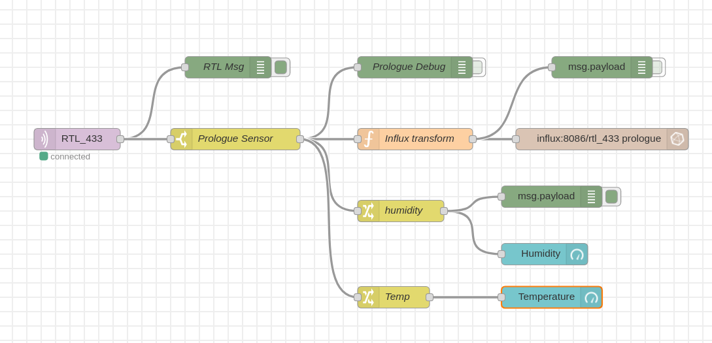

# LABStack (Version 0.0.4)


LABStack is a curated and managed collection of IoT services and tools. The
stack runs in concert in a containerized environment, typically on a small lab
server like a raspberry pi or old laptop. It allows you to get going with
current best-of-breed services with minimum effort.

LABStack is intended to be deployed on a Raspberry Pi 3 or later running Arch
ARM Linux. LABStack works fine on Raspian or most other system running a recent
docker.

Arch ARM is preferred as it is more up to date and performant, and seems a
better fit for a LAB environment, YMMV.

All services are shipped and managed in docker containers with persistent data
volumes.

# Deploy

LABStack can be deployed as is on any existing linux machine with docker already
installed by:

 - cloning this repo
 - run `./up.sh` in the `services` directory
 
This will download all the images and start the various stack services. All
services in the stack have the restart 'always' restart policy so docker will
automatically start the containers after a reboot.

For notes on prepping a new pi for LABStack on Arch see below. If you just want
to stick with Raspian (which is perfectly fine), be sure to install docker and
docker-compose.


# Usage

LABStack makes common IoT services available out of the box, but it does not set
up databases or flows, as these would be relatively unique for each environment.
It can be the basis of your own more specific stack of course. 

Once the stack is up you can 

- start adding flows from your data sources
- persist data to influxdb
- visualize your stored data in Grafana

The persistent volumes will keep your flows and data and other configs intact
between stack and server drops. Be sure to backup your volumes to keep your data
save, if that is important to you. 

Typically you would make a bespoke system, perhaps based on LABStack for
'production' flows once you have figured out what you want to do using LABStack,
and then migrate that stack to something more permanent and dedicated to that
task. In which case volume, flow and data permanence aught to get proper
attention, perhaps.

# Services

LABStack running on server `labstack` provides

| Service   | Description                         | Port or URL          |
|-----------|-------------------------------------|----------------------|
| heimdall  | Service portal                      | http://labstack      |
| portainer | Container management                | http://labstack:9000 |
| influx    | Time series database                | 8086/8083/2003       |
| grafana   | Time series data visualization      | http://labstack:3000 |
| node-red  | IIOT message switch                 | http://labstack:1880 |
| mqtt      | MQTT Broker                         | tcp:labstack:1883    |
| telegraf  | System metrics harvester            |                      |
| rtl_433   | 433Mhz SDR Dongle message harvester |                      |

With a labstack system running you have most all infrastructure in place to
gather, process, visualize and persist data in your home IIOT LAB. Container
data is persisted in volumes and can be forwarded to a cloud hosted store if
needed.

See the [docker-compose](labstack/docker-compose.yml) file for detail.

## Heimdall


Heimdall provides a landing page portal that allows you to configure all your
interesting landing pages once so you do not have to remember on which port each
service lives. Essentially a bookmarks service with some extra support for
specific services.

To get to a specific service browse to http://labstack and click on the relevant
service icon. See below on how to rename a typical raspberry pi based LABStack
server. 

Add links to LABStack services you deem fit and perhaps other links you need
quick access to, things you'll typically find in your browser's bookmarks.

## Portainer

Use portainer to manage the individual stack service containers. You can add
other services as well. Be sure to add new services to
[docker-compose.yml](labstack/docker-compose.yml) with a 'always' restart policy
if the service needs to be pulled up with the rest of the stack.


## Node-red

Nodered wired to MQTT allows message management, visualization and processing.

### rtl_433 traffic flow


The RTL_433 process uses a software defined radio dongle to receive wireless
sensor traffic on the 433Mhz band, and others, decodes the packets and submits
data messages to mqtt. Here node red picks up the message, transforms it to
influxdb line protocol and writes it to the influx time series database.

The function node example here transforms the rtl_433 message to something the
influx write node understands:

``` javascript
msg.topic="Prologue";
var orig = msg.payload;

msg.payload = [
    {
        temperature:orig.temperature_C,
        humidity:orig.humidity,
    },
    {
        battery:orig.battery,
        id:orig.id,
        rid:orig.rid,
        channel:orig.channel,
        model:orig.model,
    },
];

return msg; 
```

### Node red dashboard

Node red's Dashboard facility is fine for quick gauges and graphs if Influx +
Grafana is unnecessary. Why not both ?

Specify dash flows using the dashboard widgets



Resulting in a simple Gauge Dashboard on http://labstack:1880/ui like so:


### External message source


Feed flows in from any other available sources. Here is a another MQTT data
source.

### Plugins

The following plugins are available out of the box:

*  node-red-contrib-flightaware
*  node-red-contrib-alexa-local
*  node-red-contrib-bigtimer
*  node-red-contrib-blynk-ws
*  node-red-contrib-boolean-logic
*  node-red-contrib-config
*  node-red-contrib-diode
*  node-red-contrib-esplogin
*  node-red-contrib-file-function
*  node-red-contrib-grove
*  node-red-contrib-influxdb
*  node-red-contrib-isonline
*  node-red-contrib-moment
*  node-red-contrib-npm
*  node-red-contrib-owntracks
*  node-red-contrib-particle
*  node-red-contrib-ramp-thermostat
*  node-red-contrib-timeout
*  node-red-contrib-web-worldmap
*  node-red-dashboard
*  node-red-node-darksky
*  node-red-node-emoncms
*  node-red-node-geofence
*  node-red-node-google
*  node-red-node-openweathermap
*  node-red-node-pi-gpiod
*  node-red-node-ping
*  node-red-node-random
*  node-red-node-smooth
*  node-red-node-sqlite


## rtl_433

If a SDR dongle is plugged into the pi, this service will start harvesting
433Mhz messages and publish them to mqtt where node-red and grafana will process
and visualize them. They can also be persisted to the influx database.

## Grafana


Grafana is used to visualize data available from the influxdb and others. In
this example the RTL 433 data from the SDR dongle that was persisted to the
influx database is displayed.

# Scratch install

In short:

- install a labstack host, something like a recent pi
- Make use of the optional ansible roles to prep the pi for docker and keep
  things tight
- dotfiles to keep the pi environment sane
- docker-compose is used to maintain the service stack

## Prep SD card

From
[Archlinux|ARM](https://archlinuxarm.org/platforms/armv8/broadcom/raspberry-pi-4)
install Arch on SD Card.


## Bootstrap the basics on the pi

Boot the pi, find it on the local LAN `$ nmap -sn 10.0.0.1/24`, its called
`alarmpi`, user `alarm`, root password is `root`, change if so inclined.

ssh to `alarmpi`

 - make a user, say `thys`
 - add `thys` to wheel using `visudo`

Like so:

```
# pacman -Syyu
# useradd -G wheel -m thys
# pacman -S sudo vim
# visudo
```

Change the server name to `labstack` for convenience:

```
$ sudo hostnamectl set-hostname labstack
```

## Run ansible over pi

Check out this repo on the pi and in the `ansible` directory run `./play`. To
run the playbook over the pi from another machine with ansible installed do`./play $PI_IP`

## Start the stack

Once ansible has run to completion start the stack in `~/labstack/labstack/` by running
`up.sh`.
